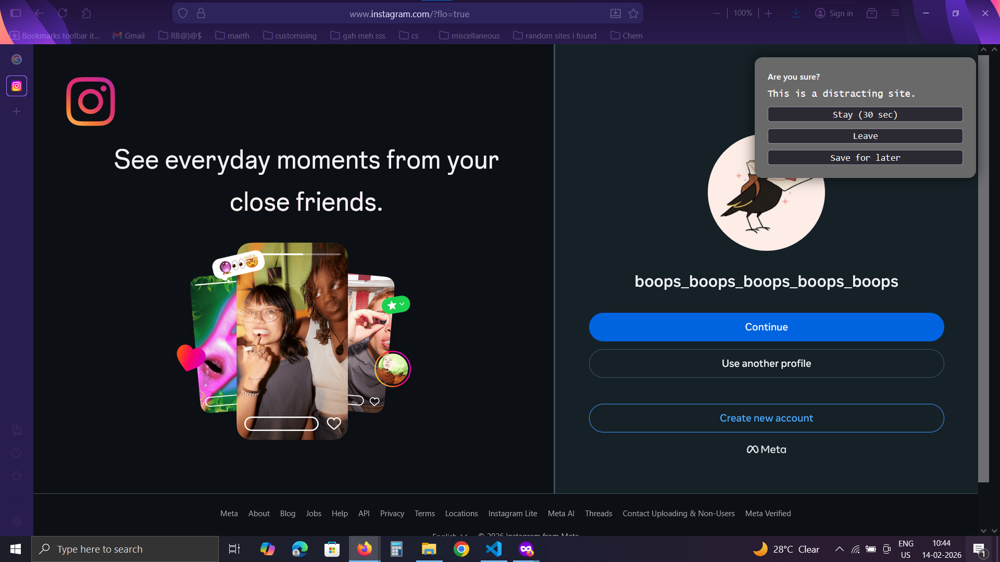
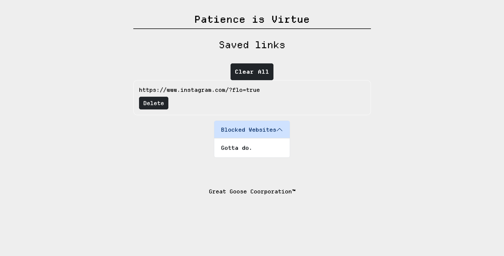

<p align="center">
  
</p>

# [Project Name] 🎯

## Basic Details

### Team Name: Gauthami

### Team Members
- Member 1: Gauthami Asok - NSS College of Engineering

### Hosted Project Link
[link](https://addons.mozilla.org/en-US/firefox/addon/are-you-sure-yes-perhaps-okay/)

### Project Description
This project is a browser extension designed to reduce impulsive browsing and promote intentional use of distracting websites. When a user opens a predefined distracting site, the extension pauses access and presents a decision popup allowing them to stay for a limited time, leave immediately, or save the page for later. Saved links are stored and displayed in a dedicated dashboard that can be accessed anytime from the extension.

### The Problem statement
Users frequently open distracting websites out of habit and end up spending unplanned time scrolling, which reduces productivity. Even when they find useful content, they often forget to revisit it later.

### The Solution
A Firefox browser extension that detects distracting websites and interrupts access with a decision popup to stay briefly, leave, or save the page for later. Saved links are stored and organized in a dedicated dashboard, enabling intentional browsing and easy content recovery.

---

## Technical Details

### Technologies/Components Used

**For Software:**
- Languages used: Javascript, HTML, CSS
- Frameworks used: Bootstrap
- Tools used: [e.g., VS Code, Git]

---

## Features

List the key features of your project:
- Feature 1: Decision popup – Pauses access and lets users stay briefly, leave, or save the page.
- Feature 2: Save for later – Stores useful links for future viewing.
- Feature 3: Saved links dashboard – Dedicated page to view and manage saved content.

---

## Implementation

### For Software:

#### Installation
 Click 'Add to Firefox' on the link above


---

## Project Documentation

### For Software:

#### Screenshots (Add at least 3)


When you click on the browser extension


What happens when you click on a distracting website


Your saved files


**Output:**
```
Processing: sample.txt
Lines processed: 3
Characters counted: 86
Status: Success
Output saved to: output.txt
```


---

## Project Demo

### Video
[Add your demo video link here - YouTube, Google Drive, etc.]

*Explain what the video demonstrates - key features, user flow, technical highlights*

### Additional Demos
[Add any extra demo materials/links - Live site, APK download, online demo, etc.]

---

## AI Tools Used (Optional - For Transparency Bonus)

If you used AI tools during development, document them here for transparency:

**Tool Used:** ChatGPT

**Purpose:** 
- Example: "Make the json file"
- Example: "To get format of CSS file"
- Example: "Debugging"

**Key Prompts Used:**
- "Create the browser?"


**Percentage of AI-generated code:** [Approximately 55%]

**Human Contributions:**
- Architecture design and planning
- Custom business logic implementation
- Integration and testing
- UI/UX design decisions

*Note: Proper documentation of AI usage demonstrates transparency and earns bonus points in evaluation!*

---

## License

This project is licensed under the [LICENSE_NAME] License - see the [LICENSE](LICENSE) file for details.

**Common License Options:**
- MIT License (Permissive, widely used)
- Apache 2.0 (Permissive with patent grant)
- GPL v3 (Copyleft, requires derivative works to be open source)

---

Made with ❤️ at TinkerHub
